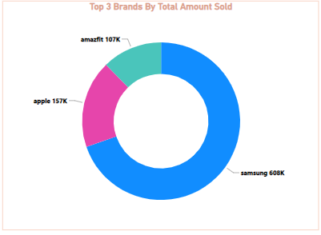

# Fitness Tracker Analysis

---
### INTRODUCTION
This dataset was provided by **POMEROL** for their monthly Data DNA challenge where one is allowed to work with a given dataset, to clean (if needed), analyze and then create a great and very effective visualization. This month’s challenge is from a fitness tracker product dataset consisting of different products from various brands with their specifications, ratings and reviews for the Indian market.

### OBJECTIVES
We were to answer the following underlisted questions in our analysis;
-	Is there a significant demand for fitness trackers in the Indian market?
- Information on the top 5 brands for fitness bands and smart watches
-	Is there a correlation between the prices and product specifications, ratings, etc.
-	Different types of fitness trackers, their price segments for different users

### ABOUT DATASET
This a somewhat small dataset consisting of different products from various brands with their specifications, ratings and reviews for the Indian market. The data has been collected from e-commerce websites namely Flipkart and Amazon using web scraping technique. This dataset contains 451 samples with 16 attributes. There are some missing values in this dataset.

### DATA CLEANING / TRANSFORMATION
The CSV file was imported into Power BI for the analysis. Here are what was done to the raw data step by step.
-	I promoted the second row to become the header, then changed the data type for of the index columns to text since I do not need the number for analysis.
-	I had to filter out empty rows, then created conditional columns to devices by price, rating review.

### ANALYSIS AND VISUALIZATIONS
                    
             |   
:------------------------------------------:| :--------------------------------------------------:
This visual shows the top 5 brands with the |    This visual shows the top 3 brands with regards
 most reviews.                              |     to total amount sold.        

                          | 
:--------------------------------------------------:| :--------------------------------------------------:
This visual shows the top 5 device models with      |  This visual shows the top 5 brands with regards
 most reviews.                                      |     to number of device model available.  
 ---
 
 ### CONCLUSION
 
 The dashboard is quite interactive,the total reviews received from all product was 818k, dizo being the brand mostly reviewed and color fit pro 2 being the gadget that raked in the most reviews. With the slicers up top, you can segment the devices based on their prizes, the materials used and rating reviews. Also, we can see that Samsung has the highest number of gadgets produced (23) as well as the brand that sold the most. Also Samsung as a brand had the most high end devices (21).

 
---

 
